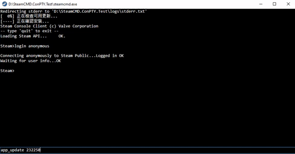

# SteamCMD.ConPTY
Real-time output from SteamCMD with Pseudo Console (ConPTY)

### Install the package
Find the package through NuGet Package Manager or install it with following command.
```sh
dotnet add package SteamCMD.ConPTY
```

## SteamCMD.ConPTY
A library using ConPTY feature to get real-time output from SteamCMD.

```cs
using SteamCMD.ConPTY;

var steamCMDConPTY = new SteamCMDConPTY
{
    Arguments = "+login anonymous +app_update 232250 +quit",
};

steamCMDConPTY.TitleReceived += (sender, data) => { };

steamCMDConPTY.OutputDataReceived += (sender, data) => { };

steamCMDConPTY.Exited += (sender, exitCode) => { };

steamCMDConPTY.Start();
```

## SteamCMD.WPF
A demo WPF application using the `SteamCMD.ConPTY` library. Requires [.NET Core 3.1](https://dotnet.microsoft.com/download/dotnet/3.1).

Download: https://github.com/WindowsGSM/SteamCMD.ConPTY/releases/latest


